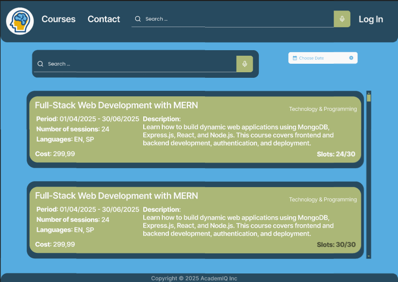
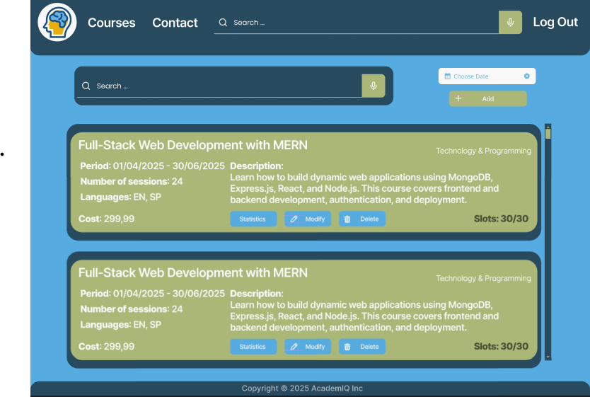
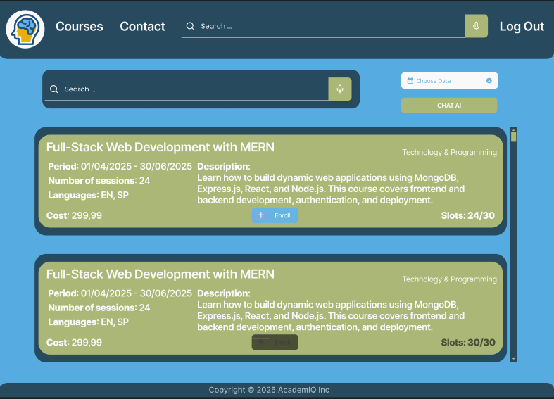
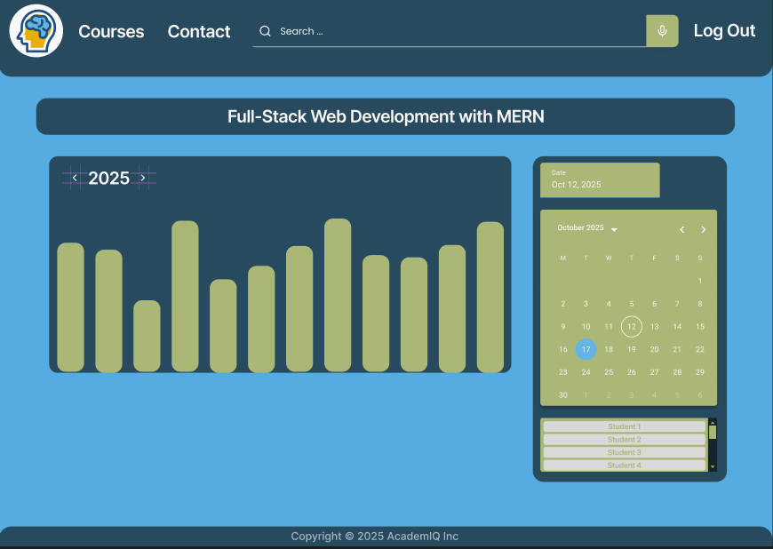

# AcademIQ - E-learning Web Application

AcademIQ is a modern e-learning web application designed to provide online courses for students and instructors. The platform enables course enrollment, management, and interactive learning experiences with AI-powered support.

## Features

### General Features
- **Navigation Menu**: Links to available pages based on user roles, including a course search engine.
- **Home Page**: Overview of the learning process and course listings.
- **Courses Page**: Displays a list of courses with essential details:
  - Title, description, category, start and end dates.
  - Number of sessions, cost, available spots, and supported languages.
  - **Filters**: Users can filter courses by start and end date (DatePicker) and category. Courses in the user's preferred language are prioritized.
- **Contact Page**: Provides contact details for the platform (phone, email).
- **User Authentication**: Sign-up and login functionality for students and instructors.

### Instructor Features
- **Course Management**: Add, edit, or remove courses.
- **Enrollment Calendar**: View enrollments in a calendar format, highlighting scheduled classes.
- **Statistics Dashboard**: Displays course participation statistics in a graphical format (students enrolled per month).

### Student Features
- **Course Enrollment**: Students can register for courses via a dedicated form.
- **Availability Indicator**: When selecting a course, unavailable courses are either hidden or marked as full.
- **AI Chatbot**: Provides automated responses to student inquiries.

## Technologies Used
- **Frontend**: HTML5, CSS, JavaScript (React.js)
- **Backend**: Node.js (Express.js)
- **Database**: MongoDB (NoSQL)
- **Styling & UX**: Ensures usability and accessibility
- **Security**: Implements web security best practices

## Setup Instructions

1. **Clone the repository**  
   ```sh
   git clone https://github.com/Schiau/AcademIQ.git
2. ** Navigate to the frontend folder**  
   ```sh
   cd academiq
3. **Setup Backend**  
   ```sh
   cd backend
   npm install
   npm start
4. **Setup Frontend**  
   ```sh
   cd frontend
   npm install
   npm start

## Screenshots

### Home Page


### Courses Page - Not Logged In View


### Courses - Professor View


### Courses - Student View


### Statistics Page

